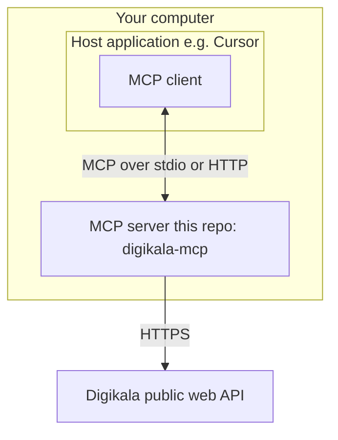
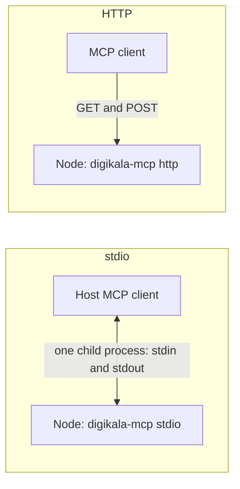

# Digikala Discovery MCP Server

A small **MCP (Model Context Protocol) server** that lets AI assistants (for example in **Cursor** or other MCP-aware apps) search [Digikala](https://www.digikala.com), read product details, and compare items—using Digikala’s public web API. **No API key** is required.

**Repository:** [github.com/rezashahnazar/digikala-mcp-v2](https://github.com/rezashahnazar/digikala-mcp-v2)  
**Version:** 2.0.0

---

## Understanding MCP in this project

**Model Context Protocol (MCP)** is an open, structured way for an application to offer **tools** (and other capabilities) to an AI so the model can call them through a small **client–server** protocol, usually with **JSON-RPC** messages. You can read the full picture at [modelcontextprotocol.io](https://modelcontextprotocol.io).

| Term | Meaning here |
|------|----------------|
| **Host (host application)** | The app you use day to day—e.g. **Cursor**, Claude Desktop, or another MCP-capable program. The host **starts** or **connects to** MCP servers and runs the user interface. |
| **MCP client** | Logic **inside the host** that talks MCP: it lists tools, calls them with arguments, and shows results. You rarely configure the “client” by name; it is bundled with the host. |
| **MCP server** | A **separate process** (this repository) that **implements** the tools. It receives requests from the client, runs the Digikala logic, and returns results. This repo is only the **server** side. |



Data flow: the **host** runs **Cursor** (for example) → the built-in **MCP client** opens a channel to the **MCP server** (this app) via a **transport** → the server fetches data from **Digikala** over the internet.

### What passes over the link: JSON-RPC (and how it relates to the host)

MCP is built on **JSON-RPC 2.0**–style messaging: the **MCP client** and **MCP server** exchange **JSON** objects (usually as text) over the chosen transport. You normally **do not** type this JSON yourself—the **host** UI shows chat and the client handles serialization—but it helps to know the shape of the traffic.

| Direction | Examples of what is sent (conceptual) |
|-----------|----------------------------------------|
| **Client → server** | **Handshake** (e.g. `initialize` with client capabilities), **“what can you do?”** (`tools/list`), **“run this tool”** (`tools/call` with a tool name and **arguments** such as a search keyword or product id). |
| **Server → client** | **Acknowledgement** and capabilities, **list of tool names and schemas**, **results** of a tool (text or structured content), or a **JSON-RPC error** (e.g. bad arguments) if something failed. |

A **request** is a JSON object with a `method` name, optional `params`, and often an `id` so the reply can be matched. A **response** has the same `id` and either a `result` or an `error` object. That is standard **JSON-RPC**; **MCP** defines the **method names and parameter shapes** (tools, resources, etc.) on top of it.

The **data your assistant sees in the end** (e.g. a block of product JSON from `search_products`) is returned **inside** that JSON-RPC `result` from the **MCP server**. That is **separate** from the JSON Digikala’s own HTTP API returns; this server **translates** Digikala responses into MCP tool results before they go back to the client.

```mermaid
sequenceDiagram
  participant Host as Host app
  participant Client as MCP client
  participant Server as digikala-mcp server
  participant DK as Digikala API
  Host->>Client: user asks; model may request a tool
  Client->>Server: JSON-RPC request tools/call
  Server->>DK: HTTPS JSON product search
  DK-->>Server: product JSON
  Server-->>Client: JSON-RPC result tool output
  Client-->>Host: show answer to user
```

### Transports: stdio and HTTP

MCP can run over more than one wire format. This project supports two:

| Transport | What it is | Typical use |
|-----------|------------|-------------|
| **stdio** (standard input/output) | The **host spawns** the server as a **child process**. The client and server send MCP messages as lines on **stdin** and **stdout**. | **Running the MCP server on your own machine** next to the host app. Best for daily use: Cursor, Claude Desktop, and most desktop tools. **No** TCP port to open. |
| **Streamable HTTP** | The server listens on a **URL**; the client uses **HTTP** (e.g. `POST` to send calls and `GET` for streaming, per the MCP “Streamable HTTP” spec). | **Exposing MCP on a server** (VPS, home lab, or team host): a stable URL, optional firewall, and optional **bearer token**. Better than stdio when clients connect over the network. |



In short: use **stdio** to run the MCP **server locally** (one machine, host spawns the process). Use **HTTP** when the MCP **server runs as a public or shared service** and clients connect to a **URL** (with TLS and a secret token in real deployments).

You do not need to memorize the wire format to use this repo: install the server, pick a transport, and follow the steps below.

---

## What you need first

1. **Node.js 20 or newer** — [Download Node](https://nodejs.org/) or use `nvm` / your package manager.
2. **pnpm** (recommended package manager for this project):

   ```bash
   corepack enable
   corepack prepare pnpm@10.15.0 --activate
   ```

   Or install pnpm [as described here](https://pnpm.io/installation).

3. **Git** — to clone [the repository](https://github.com/rezashahnazar/digikala-mcp-v2).

---

## Set up on your machine (first time)

### 1. Get the code

```bash
git clone https://github.com/rezashahnazar/digikala-mcp-v2.git
cd digikala-mcp-v2
```

### 2. Install dependencies

```bash
pnpm install
```

### 3. Build the project

```bash
pnpm run build
```

This creates the `dist/` folder with the runnable server.

---

## Run the server (most common: stdio for Cursor and similar)

The host (e.g. Cursor) usually **starts** the server and connects over **stdio**; see the transport table in [Understanding MCP](#understanding-mcp-in-this-project).

In the project folder, after a successful build:

```bash
pnpm run start:stdio
```

The process will wait for a client. When Cursor (or your MCP client) starts it, the connection is automatic.

### Connect from Cursor

1. Open **Cursor** → **Settings** → **MCP** (or edit your MCP config file—location depends on Cursor version; search for `mcp.json` in their docs if unsure).
2. Add a server entry that runs **Node** on the built `cli.js` with the `stdio` argument.
3. Use the **full path** to `dist/cli.js` on your machine, for example:

   ```json
   {
     "mcpServers": {
       "digikala": {
         "command": "node",
         "args": ["/home/you/projects/digikala-mcp-v2/dist/cli.js", "stdio"]
       }
     }
   }
   ```

4. On **Windows**, use a path like `C:\\Users\\You\\...\\dist\\cli.js`.
5. Restart or reload the MCP list in Cursor if the server does not appear.
6. In chat, you should be able to use tools such as “search Digikala” (exact wording depends on the model).

For day-to-day development of this repo (optional):

```bash
pnpm run dev
```

For connecting **Cursor** to the server, prefer the **built** `dist/cli.js` as shown above so paths stay stable.

---

## Run over HTTP (optional, advanced)

Use this if your **host** supports **MCP over HTTP** (Streamable HTTP) instead of starting a local stdio process—typical for a server you keep running, access from another machine, or when the app only has a “remote URL” field.

### 1. Start this project’s HTTP server

```bash
pnpm run start:http
```

Keep this process running while the host connects.

**Defaults** (unless you override with env): listen on `127.0.0.1:33445`, path `/mcp` → the MCP base URL is:

`http://127.0.0.1:33445/mcp`

| Environment variable | Default | Purpose |
|----------------------|---------|---------|
| `DIGIKALA_MCP_HTTP_HOST` | `127.0.0.1` | Interface to listen on (`0.0.0.0` only if you need LAN access) |
| `DIGIKALA_MCP_HTTP_PORT` | `33445` | Port |
| `DIGIKALA_MCP_HTTP_PATH` | `/mcp` | Base path (POST, GET, DELETE for Streamable HTTP) |
| `DIGIKALA_MCP_HTTP_BEARER_TOKEN` | (empty) | If set, every request must include `Authorization: Bearer <token>` |

**`.env` is optional.** You can run with **no** `.env` file: defaults (host, port, path) apply, and **no** bearer token is required—fine for local HTTP on `127.0.0.1`. Add a `.env` only when you want to override defaults or set secrets without typing them in the shell each time.

`pnpm run start:http` (and `node dist/cli.js http`) will **read** a `.env` in the project root if it exists, using [`dotenv`](https://github.com/motdotla/dotenv). You can always set the same variables in the environment instead of using a file.

**Bearer token (also optional for local use):** set `DIGIKALA_MCP_HTTP_BEARER_TOKEN` in **`.env`** (when you use one) or `export` it in the shell. Skip it entirely when you do not want HTTP auth. **Do not commit secrets:** `.env` is gitignored. See [`.env.example`](.env.example) for all keys.

If you open the service beyond your own PC, set a **strong** bearer token and lock down the network.

### 2. Point the **host** at that URL (configure the client)

The **host** is not running `node dist/cli.js` in this mode; it only needs the **MCP base URL** (and headers if you use a token). Exact screens vary by app; in **Cursor** you can use the same `mcpServers` JSON as in the [Cursor MCP docs](https://cursor.com/docs) (e.g. **Tools & MCP** in settings, or `.cursor/mcp.json` in the project, or `~/.cursor/mcp.json` for all projects).

**No bearer token (default local use):** add a server entry with a `url` field pointing at the full base path:

```json
{
  "mcpServers": {
    "digikala-http": {
      "url": "http://127.0.0.1:33445/mcp"
    }
  }
}
```

**With bearer token** (required if you set `DIGIKALA_MCP_HTTP_BEARER_TOKEN` when starting the server):

```json
{
  "mcpServers": {
    "digikala-http": {
      "url": "http://127.0.0.1:33445/mcp",
      "headers": {
        "Authorization": "Bearer your-secret-token"
      }
    }
  }
}
```

Use the **same** token as in `DIGIKALA_MCP_HTTP_BEARER_TOKEN`. You can keep the secret out of the file with Cursor’s config interpolation, e.g. `Bearer ${env:DIGIKALA_MCP_HTTP_BEARER_TOKEN}` in `headers`, if your version supports it (see [Cursor variable docs](https://cursor.com/docs)).

**Checklist for the host:**

1. `pnpm run start:http` is running and prints the listen address.
2. The URL in the host **includes the path** (`/mcp` if you use defaults, or whatever you set in `DIGIKALA_MCP_HTTP_PATH`).
3. If you use a token, the server and the host **both** use it.
4. For another device on the LAN, the server must bind to a reachable address (e.g. `0.0.0.0`) and the host’s URL must use that machine’s **IP or hostname**, not `127.0.0.1`.

Other apps (e.g. Claude Desktop) that support **Streamable HTTP** / remote MCP usually follow the same idea: **URL + optional headers** in their config file. Refer to that app’s current documentation.

---

## Tools provided

| Tool | What it does |
|------|----------------|
| `get_search_suggestions` | Search suggestions and category hints |
| `search_products` | Product search with filters (prices in **toman**) |
| `get_product_details` | Full product page–style data |
| `get_similar_products` | Similar / recommended products |
| `search_products_by_image_description` | Style-oriented (“text lenz”) search |
| `get_products_batch` | Load several products by id (shortlist) |

---

## Project scripts

| Command | Meaning |
|---------|--------|
| `pnpm run build` | Compile TypeScript to `dist/` |
| `pnpm run start:stdio` | Run MCP over stdio (default for Cursor) |
| `pnpm run start:http` | Run Streamable HTTP server |
| `pnpm run dev` / `pnpm run dev:http` | Develop without building |
| `pnpm test` | Unit tests + **live** Digikala API checks (needs internet) |
| `pnpm run test:unit` | Unit tests only (no network) |
| `pnpm run lint` | ESLint |

### Tests and network

- `pnpm test` runs fast unit tests and one **integration** suite in [`src/integration/digikala-live.integration.test.ts`](src/integration/digikala-live.integration.test.ts) that calls the real `api.digikala.com` endpoints (shared `fetchJson` client plus every `run*…` handler).
- **Offline or CI without outbound access:** set `SKIP_INTEGRATION=1` so that suite is skipped; unit tests still run.

---

## Limitations

- Data comes from Digikala’s public services; be reasonable about request volume and follow their terms of use.
- Advanced MCP or HTTP client setup depends on the app you use; always use current documentation for that app.

---
